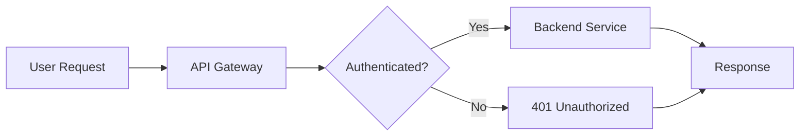
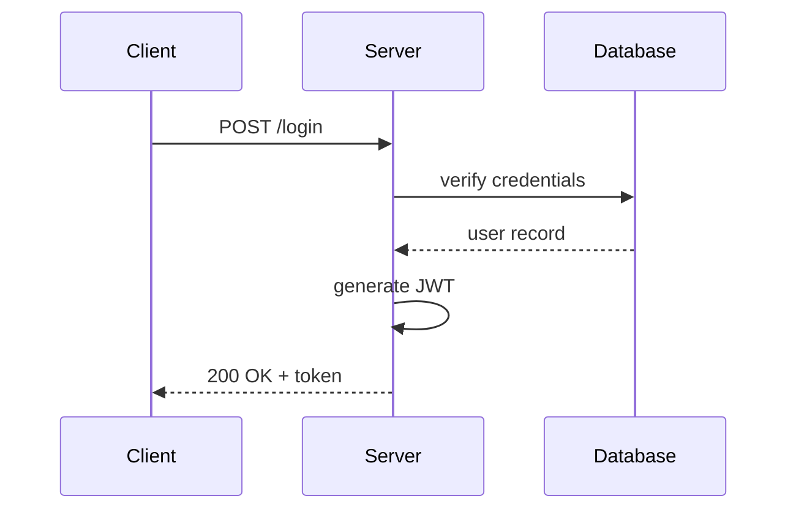
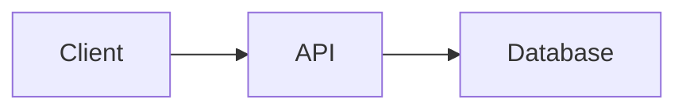

# Markdown Guide — Reference with Examples

A practical Markdown reference where every feature is shown twice — **the raw source** in a fenced code block, then **the rendered output** immediately below — so you can see exactly what each piece of syntax produces.

**Sources:**
- [markdowntutorial.com](https://www.markdowntutorial.com/) — interactive 10-minute tutorial
- [markdownguide.org](https://www.markdownguide.org/) — full reference
- [GitHub: Basic writing and formatting syntax](https://docs.github.com/en/get-started/writing-on-github/getting-started-with-writing-and-formatting-on-github/basic-writing-and-formatting-syntax)
- [GitHub Flavored Markdown Spec](https://github.github.com/gfm/)

---

## How to read this guide

Every section follows the same shape:

1. **What it is** — a sentence on the feature.
2. **Source** — the raw markdown you type, inside a fenced code block.
3. **Renders as** — what it actually looks like when displayed.
4. **Notes / gotchas** — the things that bite you.

When you open this file in VS Code preview, Obsidian, or on GitHub, the "Renders as" parts will already be rendered. The "Source" parts stay as raw text inside code blocks. That side-by-side is the whole point.

---

## Table of Contents

**Foundations**
- [1. What Is Markdown?](#1-what-is-markdown)
- [2. Where You'll Use It](#2-where-youll-use-it)
- [3. Markdown Flavors](#3-markdown-flavors)

**Core Syntax**
- [4. Headings](#4-headings)
- [5. Paragraphs and Line Breaks](#5-paragraphs-and-line-breaks)
- [6. Bold, Italic, and Combined Emphasis](#6-bold-italic-and-combined-emphasis)
- [7. Lists (Unordered, Ordered, Nested, Task Lists)](#7-lists-unordered-ordered-nested-task-lists)
- [8. Inline Code and Code Blocks](#8-inline-code-and-code-blocks)
- [9. Hyperlinks](#9-hyperlinks)
- [10. Images](#10-images)
- [11. Blockquotes](#11-blockquotes)
- [12. Horizontal Rules](#12-horizontal-rules)

**Tables and Structured Data**
- [13. Tables](#13-tables)
- [14. Column Alignment](#14-column-alignment)
- [15. Tables with Code, Links, and Formatting](#15-tables-with-code-links-and-formatting)

**Linking Within and Between Documents**
- [16. Anchor Links and Heading IDs](#16-anchor-links-and-heading-ids)
- [17. Custom Heading IDs](#17-custom-heading-ids)
- [18. Reference-Style Links](#18-reference-style-links)
- [19. Footnotes](#19-footnotes)
- [20. Linking Between Files in a Repo](#20-linking-between-files-in-a-repo)

**Common but Often Forgotten**
- [21. Strikethrough](#21-strikethrough)
- [22. Escaping Special Characters](#22-escaping-special-characters)
- [23. HTML Inside Markdown](#23-html-inside-markdown)

**GitHub-Specific Features**
- [24. Task Lists with Checkboxes](#24-task-lists-with-checkboxes)
- [25. Auto-Linked References (Issues, PRs, Commits, @Mentions)](#25-auto-linked-references-issues-prs-commits-mentions)
- [26. Syntax Highlighting in Code Blocks](#26-syntax-highlighting-in-code-blocks)
- [27. Collapsible Sections](#27-collapsible-sections)
- [28. Alerts / Callouts](#28-alerts--callouts)
- [29. Badges in READMEs](#29-badges-in-readmes)
- [30. Emoji](#30-emoji)
- [31. Diagrams with Mermaid](#31-diagrams-with-mermaid)

**Math**
- [32. LaTeX Math (Jupyter and GitHub)](#32-latex-math-jupyter-and-github)

**Templates**
- [33. README Template](#33-readme-template)

**Reference**
- [34. Quick Cheat Sheet](#34-quick-cheat-sheet)
- [35. Common Mistakes](#35-common-mistakes)

---

## 1. What Is Markdown?

Markdown is a lightweight markup language created by John Gruber in 2004. You annotate plain text with simple symbols (`#`, `*`, `-`, `>`, etc.) and a renderer turns those symbols into formatted HTML when displayed.

The core promise: **the raw `.md` file should still be readable as plain text**, even before rendering. `**bold**` is recognisable as emphasis even in a terminal.

### The two-layer model

```
You write:    Plain text + Markdown symbols   →  .md file
Renderer:     .md file + parser               →  HTML / PDF / display
```

The `.md` file is just a text file. Any editor opens it. Rendering only happens in apps that know how to parse Markdown — GitHub, VS Code preview, Jupyter, Obsidian, Pandoc.

### Why use it?

- **Portable.** Plain text. Opens anywhere, on any OS, in any decade.
- **Git-friendly.** Diffs cleanly line by line, unlike binary formats (`.docx`, `.pptx`).
- **Fast to write.** No mouse trips to the toolbar — your hands stay on the keyboard.
- **Standard.** READMEs, technical docs, blog posts, issue trackers, and most documentation sites all speak Markdown.
- **Convertible.** Pandoc and friends turn it into HTML, PDF, Word, slides, ePub, and more.

---

## 2. Where You'll Use It

| Place | What for |
| :--- | :--- |
| GitHub repos | `README.md` (front page of every project), Issues, Pull Requests |
| Jupyter Notebooks | Markdown cells alongside code cells |
| VS Code | Editing and previewing — open preview with `Ctrl+Shift+V` / `Cmd+Shift+V` |
| Obsidian | Cross-linked notes via `[[wikilinks]]` |
| GitHub Pages | Static sites built from Markdown via Jekyll |
| Static site generators | Hugo, MkDocs, Docusaurus, Astro, Next.js MDX |
| Library documentation | Most modern OSS docs (FastAPI, React, Tailwind, etc.) |

---

## 3. Markdown Flavors

Standard Markdown is the baseline. Most platforms use an extended version.

| Flavor | Where | What it adds |
| :--- | :--- | :--- |
| **Standard Markdown** | Baseline | Core syntax only |
| **GitHub Flavored Markdown (GFM)** | GitHub, most modern editors | Tables, task lists, strikethrough, auto-linking, alerts |
| **CommonMark** | Many parsers | Stricter, more consistent standard Markdown |
| **Jupyter Markdown** | Jupyter notebooks | GFM + LaTeX math via MathJax |
| **Obsidian Markdown** | Obsidian | GFM + `[[wikilinks]]`, callouts, graph view |

**Practical rule:** Write to GFM. It works everywhere you care about.

---

## 4. Headings

Six levels, prefixed with `#`. One space between `#` and the text. One blank line before and after.

**Source:**

```markdown
# H1 — Document title (one per file)
## H2 — Major section
### H3 — Subsection
#### H4 — Rare
##### H5 — Rarer
###### H6 — Almost never
```

**Renders as:**

> # H1 — Document title (one per file)
> ## H2 — Major section
> ### H3 — Subsection
> #### H4 — Rare
> ##### H5 — Rarer
> ###### H6 — Almost never

**Notes:**
- One `# H1` per file — that's your document title.
- In practice never go beyond `### H3`. Deep nesting hurts readability.
- `#Heading` (no space) does not render in many parsers. Always `# Heading`.
- Always blank line before and after.

---

## 5. Paragraphs and Line Breaks

A paragraph is just text. **Two paragraphs require a blank line between them.** A single newline does *not* create a new paragraph — the renderer treats it as continuing the same one.

**Source:**

```markdown
This is paragraph one.

This is paragraph two. The blank line above is what separates them.
```

**Renders as:**

> This is paragraph one.
>
> This is paragraph two. The blank line above is what separates them.

### Line break within a paragraph

End the line with **two trailing spaces**, or use `<br>`.

**Source:**

```markdown
First line of the same paragraph.  
Second line, same paragraph (notice two spaces at end of first line).

Or use HTML:<br>
This line follows a hard break.
```

**Renders as:**

> First line of the same paragraph.  
> Second line, same paragraph (notice two spaces at end of first line).
>
> Or use HTML:<br>
> This line follows a hard break.

**Notes:**
- Trailing spaces are invisible — easy to lose. `<br>` is more explicit.
- Don't indent paragraph text with spaces or tabs — that triggers an unintended code block.

---

## 6. Bold, Italic, and Combined Emphasis

**Source:**

```markdown
**bold text** with double asterisks.
*italic text* with single asterisks.
***bold and italic*** with triple asterisks.

You can also use __bold__ and _italic_ with underscores, but prefer asterisks.
```

**Renders as:**

> **bold text** with double asterisks.
> *italic text* with single asterisks.
> ***bold and italic*** with triple asterisks.
>
> You can also use __bold__ and _italic_ with underscores, but prefer asterisks.

**Notes:**
- Use `*asterisks*` not `_underscores_` for mid-word emphasis. Underscores inside words (e.g. `snake_case`) confuse some parsers.
- For combined bold + italic, all three asterisks must be on each side: `***text***`.

---

## 7. Lists (Unordered, Ordered, Nested, Task Lists)

### Unordered

**Source:**

```markdown
- First item
- Second item
- Third item
```

**Renders as:**

> - First item
> - Second item
> - Third item

You can use `-`, `*`, or `+` as the bullet — pick one and stay consistent. `-` is most common.

### Ordered

**Source:**

```markdown
1. First step
2. Second step
3. Third step
```

**Renders as:**

> 1. First step
> 2. Second step
> 3. Third step

### Lazy numbering trick

Write `1.` for every item — the renderer auto-numbers them. This means you can insert a new step in the middle without renumbering everything.

**Source:**

```markdown
1. First step
1. Second step
1. Third step
```

**Renders as:**

> 1. First step
> 1. Second step
> 1. Third step

### Nested lists

Indent **4 spaces (or 1 tab) per level**.

**Source:**

```markdown
- Outer item
    - Sub-item A
    - Sub-item B
        - Deeper still
- Next outer item
```

**Renders as:**

> - Outer item
>     - Sub-item A
>     - Sub-item B
>         - Deeper still
> - Next outer item

### Mixing ordered and unordered

**Source:**

```markdown
1. First major step
    - Note about this step
    - Another note
2. Second major step
    - Yet another note
```

**Renders as:**

> 1. First major step
>     - Note about this step
>     - Another note
> 2. Second major step
>     - Yet another note

### Adding paragraphs or blockquotes inside list items

Indent the inner element 4 spaces and leave a blank line.

**Source:**

```markdown
- First item.

    A paragraph that belongs to the first item.

- Second item.

    > A blockquote inside the second item.

- Third item.
```

**Renders as:**

> - First item.
>
>     A paragraph that belongs to the first item.
>
> - Second item.
>
>     > A blockquote inside the second item.
>
> - Third item.

### Task lists (checkboxes — GFM)

The single most useful list type for to-dos and project checklists.

**Source:**

```markdown
- [x] Set up the repo
- [x] Add a README
- [ ] Write tests
- [ ] Push to GitHub
```

**Renders as:**

> - [x] Set up the repo
> - [x] Add a README
> - [ ] Write tests
> - [ ] Push to GitHub

On GitHub these become **interactive checkboxes** — you can click them in the rendered view and the underlying file gets updated.

---

## 8. Inline Code and Code Blocks

### Inline code

Wrap in single backticks. Use for variable names, function names, file paths, short commands.

**Source:**

```markdown
Run `pytest` before pushing. The function `train()` lives in `src/model.py`.
```

**Renders as:**

> Run `pytest` before pushing. The function `train()` lives in `src/model.py`.

If your code itself contains a backtick, wrap with **double** backticks:

**Source:**

```markdown
Use ``backticks like `this` `` to escape inner backticks.
```

**Renders as:**

> Use ``backticks like `this` `` to escape inner backticks.

### Fenced code blocks

Triple backticks. **Always specify the language** for syntax highlighting.

**Source:**

````markdown
```python
def greet(name: str) -> str:
    return f"Hello, {name}!"
```
````

**Renders as:**

```python
def greet(name: str) -> str:
    return f"Hello, {name}!"
```

**Source:**

````markdown
```bash
npm install
npm test
```
````

**Renders as:**

```bash
npm install
npm test
```

**Source:**

````markdown
```sql
SELECT user_id, COUNT(*) AS purchases
FROM orders
GROUP BY user_id
HAVING COUNT(*) > 5;
```
````

**Renders as:**

```sql
SELECT user_id, COUNT(*) AS purchases
FROM orders
GROUP BY user_id
HAVING COUNT(*) > 5;
```

**Source:**

````markdown
```json
{
  "name": "my-package",
  "version": "1.0.0",
  "private": true
}
```
````

**Renders as:**

```json
{
  "name": "my-package",
  "version": "1.0.0",
  "private": true
}
```

**Common language tags:** `python`, `bash`, `sh`, `sql`, `javascript`, `typescript`, `json`, `yaml`, `markdown`, `html`, `css`, `dockerfile`, `text`, `diff`, `go`, `rust`, `java`, `c`, `cpp`.

### Showing markdown source inside a code block

If you want a code block that itself contains triple backticks (like every example in this guide), wrap it with **four** backticks instead of three:

**Source:**

`````markdown
````markdown
```python
print("hello")
```
````
`````

**Renders as:**

````markdown
```python
print("hello")
```
````

That's exactly the trick this guide uses to display markdown source.

---

## 9. Hyperlinks

### Inline links — the everyday form

**Source:**

```markdown
Visit [the Markdown Guide](https://www.markdownguide.org) for more.

You can also add a tooltip: [Markdown Guide](https://www.markdownguide.org "Hover for the Markdown Guide homepage").
```

**Renders as:**

> Visit [the Markdown Guide](https://www.markdownguide.org) for more.
>
> You can also add a tooltip: [Markdown Guide](https://www.markdownguide.org "Hover for the Markdown Guide homepage").

### Auto-links — bare URLs

Wrap a URL or email in `<>` to make it a clickable auto-link.

**Source:**

```markdown
<https://www.markdownguide.org>
<hello@example.com>
```

**Renders as:**

> <https://www.markdownguide.org>
> <hello@example.com>

On GitHub a bare URL without `<>` *also* gets auto-linked, but `<>` is the portable standard.

### Formatting inside links

You can bold, italicise, or wrap link text in code.

**Source:**

```markdown
**[Bold link](https://example.com)**
*[Italic link](https://example.com)*
[`code link`](https://example.com)
```

**Renders as:**

> **[Bold link](https://example.com)**
> *[Italic link](https://example.com)*
> [`code link`](https://example.com)

### Linking to a file in the same repo

Use a relative path.

**Source:**

```markdown
See [the contributing guide](./CONTRIBUTING.md).
See [the changelog](../CHANGELOG.md).
```

**Renders as:**

> See [the contributing guide](./CONTRIBUTING.md).
> See [the changelog](../CHANGELOG.md).

(Links resolve against wherever this file sits in the repo.)

---

## 10. Images

The syntax is `` — exactly like a link, prefixed with `!`.

### Local image

**Source:**

```markdown

```

**Renders as** (it tries to load the file from `assets/architecture.png` relative to the `.md` file — broken here because the file doesn't exist, but the syntax is correct):

> 

### Remote image

**Source:**

```markdown

```

**Renders as:**

> 

### Image with a title (hover tooltip)

**Source:**

```markdown

```

**Renders as:**

> 

### Image as a clickable link

Wrap the image in a link.

**Source:**

```markdown
[](https://github.com/yourname/yourrepo/actions)
```

**Renders as:**

> [](https://github.com/yourname/yourrepo/actions)

(Click the badge → goes to the Actions page.)

### Resizing images

Standard Markdown has no resize syntax. If you need to resize, use HTML:

**Source:**

```markdown

```

**Renders as:**

> 

**Notes:**
- **Always write descriptive alt text.** It's accessibility, it shows when the image fails to load, and search engines use it.
- Store images in an `assets/` or `images/` folder inside each repo. Don't link to images on imgur or random hosts — they break.
- For diagrams, prefer Mermaid (Section 31) over images when possible — they version-control as text.

---

## 11. Blockquotes

Prefix a line with `>`.

**Source:**

```markdown
> This is a quoted block. It's used for citations, callouts, or emphasising someone else's text.
```

**Renders as:**

> This is a quoted block. It's used for citations, callouts, or emphasising someone else's text.

### Multi-paragraph blockquotes

Continue with `>` on the blank line between paragraphs.

**Source:**

```markdown
> First paragraph of the quote.
>
> Second paragraph of the same quote.
```

**Renders as:**

> First paragraph of the quote.
>
> Second paragraph of the same quote.

### Nested blockquotes

**Source:**

```markdown
> Outer quote.
>
> > Nested reply.
> >
> > > Nested deeper.
```

**Renders as:**

> Outer quote.
>
> > Nested reply.
> >
> > > Nested deeper.

### Blockquotes with other markdown inside

**Source:**

```markdown
> **Donald Knuth:** *"Premature optimization is the root of all evil."*
>
> Key takeaways:
> - Measure before optimising
> - Focus on hot paths
> - Readable code first
```

**Renders as:**

> **Donald Knuth:** *"Premature optimization is the root of all evil."*
>
> Key takeaways:
> - Measure before optimising
> - Focus on hot paths
> - Readable code first

---

## 12. Horizontal Rules

Three or more `-`, `*`, or `_` on a line by themselves. Use to break a document into top-level visual sections.

**Source:**

```markdown
Section above.

---

Section below.
```

**Renders as:**

> Section above.
>
> ---
>
> Section below.

**Notes:**
- Always blank lines before and after, otherwise some parsers interpret `---` under text as a heading underline (alternate H2 syntax).
- Use `---` consistently. Don't mix `---`, `***`, and `___` in the same file.

---

## 13. Tables

GFM tables use pipes `|` for columns and `---` for the header separator.

**Source:**

```markdown
| Language | Year | Designer |
| --- | --- | --- |
| Python | 1991 | Guido van Rossum |
| JavaScript | 1995 | Brendan Eich |
| Go | 2009 | Robert Griesemer, Rob Pike, Ken Thompson |
| Rust | 2010 | Graydon Hoare |
```

**Renders as:**

| Language | Year | Designer |
| --- | --- | --- |
| Python | 1991 | Guido van Rossum |
| JavaScript | 1995 | Brendan Eich |
| Go | 2009 | Robert Griesemer, Rob Pike, Ken Thompson |
| Rust | 2010 | Graydon Hoare |

**Notes:**
- The outer `|` at line start and end is optional but improves readability.
- The header separator must have at least three `-` per cell (`---`).
- Columns don't need to be visually aligned in the source; the renderer aligns them. But it's easier to read source if you do align — most editors do this automatically.

---

## 14. Column Alignment

Add `:` to the separator row to control alignment.

**Source:**

```markdown
| Left aligned | Centered | Right aligned |
| :--- | :---: | ---: |
| short | text | $1.00 |
| longer text | more text | $1234.56 |
| even longer | the most | $42.00 |
```

**Renders as:**

| Left aligned | Centered | Right aligned |
| :--- | :---: | ---: |
| short | text | $1.00 |
| longer text | more text | $1234.56 |
| even longer | the most | $42.00 |

**Rules:**
- `:---` = left aligned (default)
- `:---:` = centered
- `---:` = right aligned

Use right alignment for numeric columns so digits line up.

---

## 15. Tables with Code, Links, and Formatting

Tables can contain inline code, links, bold, italic — basically any inline markdown.

**Source:**

```markdown
| Library | Use case | Docs |
| :--- | :--- | :--- |
| `numpy` | Numerical arrays | [docs](https://numpy.org) |
| `pandas` | **Tabular data** | [docs](https://pandas.pydata.org) |
| `scikit-learn` | *Classical ML* | [docs](https://scikit-learn.org) |
| `requests` | HTTP client | [docs](https://requests.readthedocs.io) |
```

**Renders as:**

| Library | Use case | Docs |
| :--- | :--- | :--- |
| `numpy` | Numerical arrays | [docs](https://numpy.org) |
| `pandas` | **Tabular data** | [docs](https://pandas.pydata.org) |
| `scikit-learn` | *Classical ML* | [docs](https://scikit-learn.org) |
| `requests` | HTTP client | [docs](https://requests.readthedocs.io) |

### Pipes inside table cells

If you need a literal `|` in a cell, escape it with `\|` or use the HTML entity `&#124;`.

**Source:**

```markdown
| Operator | Meaning |
| :--- | :--- |
| `\|\|` | Logical OR |
| `&` | Bitwise AND |
```

**Renders as:**

| Operator | Meaning |
| :--- | :--- |
| `\|\|` | Logical OR |
| `&` | Bitwise AND |

### Multi-line content in a cell

Tables don't support real line breaks. Use `<br>` for visual line breaks within a cell.

**Source:**

```markdown
| Service | Notes |
| :--- | :--- |
| FastAPI | REST API<br>Async support<br>Pydantic validation |
| Postgres | SQL DB<br>ACID compliant |
```

**Renders as:**

| Service | Notes |
| :--- | :--- |
| FastAPI | REST API<br>Async support<br>Pydantic validation |
| Postgres | SQL DB<br>ACID compliant |

---

## 16. Anchor Links and Heading IDs

Every heading automatically gets an **ID** based on its text. You can link to that ID from anywhere in the same document — this is how the Table of Contents at the top of this file works.

**The auto-ID rule** (GitHub):
1. Lowercase everything.
2. Strip punctuation (except `-`).
3. Replace spaces with `-`.

So `## Bold, Italic, and Combined Emphasis` becomes `#bold-italic-and-combined-emphasis`.

The `#` tells Markdown (and browsers) that you're linking to a fragment identifier, i.e., a specific section within the same page, not a different page.

### Linking to a heading in the same file

**Source:**

```markdown
Jump to [the tables section](#13-tables) or [the cheat sheet](#34-quick-cheat-sheet).
```

**Renders as:**

> Jump to [the tables section](#13-tables) or [the cheat sheet](#34-quick-cheat-sheet).

### Linking to a heading in a different file

Combine the file path with the anchor.

**Source:**

```markdown
See [the installation section in the README](./README.md#installation).
```

**Renders as:**

> See [the installation section in the README](./README.md#installation).

---

## 17. Custom Heading IDs

Standard Markdown doesn't support custom IDs, but many parsers (including most GitHub-Pages-style renderers and Pandoc) do. **GitHub.com itself does not** — on github.com, you stick with auto-generated IDs.

**Source:**

```markdown
### My Custom Section {#my-anchor}

Link to it: [jump here](#my-anchor)
```

**Renders as on parsers that support it:**

> ### My Custom Section
>
> Link to it: jumps to id `my-anchor`

**Notes:**
- On GitHub, this just renders the `{#my-anchor}` as literal text in the heading. So **don't use it for anything that lives on GitHub**.
- Use it for Jekyll-based GitHub Pages sites, Obsidian, Pandoc-generated docs, MkDocs.
- For GitHub portability, just use the auto-generated ID.

---

## 18. Reference-Style Links

Define the URL once at the bottom of the file, reference it inline by a label. Useful when:
- The same URL is used many times.
- The URL is long and clutters the prose.
- You want a clean, citation-like list of sources at the end.

**Source:**

```markdown
This guide draws from the [Markdown Guide][mg], the [GitHub docs][ghd], and the [interactive tutorial][mt]. The [Markdown Guide][mg] is the most comprehensive.

[mg]: https://www.markdownguide.org "The Markdown Guide"
[ghd]: https://docs.github.com/en/get-started/writing-on-github
[mt]: https://www.markdowntutorial.com
```

**Renders as:**

> This guide draws from the [Markdown Guide][mg], the [GitHub docs][ghd], and the [interactive tutorial][mt]. The [Markdown Guide][mg] is the most comprehensive.
>
> [mg]: https://www.markdownguide.org "The Markdown Guide"
> [ghd]: https://docs.github.com/en/get-started/writing-on-github
> [mt]: https://www.markdowntutorial.com

The reference definitions themselves don't render — only the links.

### Implicit references (label = link text)

If the label and link text are the same, you can use the empty bracket form `[][]`:

**Source:**

```markdown
See the [Markdown Guide][] for the full reference.

[Markdown Guide]: https://www.markdownguide.org
```

**Renders as:**

> See the [Markdown Guide][] for the full reference.
>
> [Markdown Guide]: https://www.markdownguide.org

---

## 19. Footnotes

Footnotes are a GFM/Pandoc extension. Define them with `[^label]` inline and `[^label]: text` at the bottom (or anywhere). Order doesn't matter — the renderer numbers them in order of appearance.

**Source:**

```markdown
Markdown was created by John Gruber[^1] in 2004. GitHub later defined GFM[^gfm] as the dominant flavor in practice.

[^1]: A blogger and software developer; also created the Daring Fireball blog.
[^gfm]: GitHub Flavored Markdown — the GitHub-specific superset.
```

**Renders as:**

> Markdown was created by John Gruber[^1] in 2004. GitHub later defined GFM[^gfm] as the dominant flavor in practice.
>
> [^1]: A blogger and software developer; also created the Daring Fireball blog.
> [^gfm]: GitHub Flavored Markdown — the GitHub-specific superset.

**Notes:**
- GitHub renders footnotes; many other parsers do too. CommonMark strict does not.
- Labels can be numbers (`[^1]`) or words (`[^gfm]`). Words are easier to maintain.
- The renderer collects all footnotes and lists them at the bottom of the document with back-links.

---

## 20. Linking Between Files in a Repo

Inside a multi-file repo, use relative paths so links keep working when the repo is cloned, mirrored, or viewed locally.

**Source:**

```markdown
- [README](./README.md)
- [Contributing guide](./CONTRIBUTING.md)
- [Changelog one level up](../CHANGELOG.md)
- [License two levels up](../../LICENSE)
- Heading inside another file: [installation section](./README.md#installation)
```

**Renders as:**

> - [README](./README.md)
> - [Contributing guide](./CONTRIBUTING.md)
> - [Changelog one level up](../CHANGELOG.md)
> - [License two levels up](../../LICENSE)
> - Heading inside another file: [installation section](./README.md#installation)

**Path conventions:**
- `./` = same directory
- `../` = parent directory
- `../../` = grandparent
- No leading `/` (that means root of the filesystem, not the repo)

---

## 21. Strikethrough

Wrap text in **double tildes** `~~`.

**Source:**

```markdown
~~This was true~~ This is the corrected version.

Status: ~~In progress~~ Complete.
```

**Renders as:**

> ~~This was true~~ This is the corrected version.
>
> Status: ~~In progress~~ Complete.

Strikethrough is GFM — works on GitHub, in VS Code, in Obsidian. Not in CommonMark strict.

---

## 22. Escaping Special Characters

If you need a literal `*`, `#`, `_`, `\`, `` ` ``, `[`, `]`, etc., put a backslash `\` before it.

**Source:**

```markdown
\*not italic\*
\# not a heading
\[not a link\]
1\. not a numbered list
```

**Renders as:**

> \*not italic\*
> \# not a heading
> \[not a link\]
> 1\. not a numbered list

### Characters that often need escaping

| Char | Why escape it | Escape as |
| :--- | :--- | :--- |
| `\` | Backslash itself | `\\` |
| `` ` `` | Triggers inline code | `` \` `` |
| `*` | Triggers bold/italic | `\*` |
| `_` | Triggers bold/italic | `\_` |
| `#` | Triggers heading at line start | `\#` |
| `+` `-` | Triggers list at line start | `\+` `\-` |
| `.` | After a number triggers ordered list | `\.` (e.g. `1\.`) |
| `!` | Triggers image when followed by `[` | `\!` |
| `[` `]` | Triggers link | `\[` `\]` |
| `(` `)` | Part of link syntax | `\(` `\)` |
| `{` `}` | Some parsers (custom IDs, MyST) | `\{` `\}` |
| `<` `>` | HTML / auto-link | `\<` `\>` |
| `\|` | Table column separator | `\|` |

### HTML entities (alternative to backslash escaping)

Useful for special characters that don't have a backslash form, or when you want a specific Unicode character.

**Source:**

```markdown
Copyright &copy; 2026.
The price is &dollar;199.50.
Em dash&mdash;like this.
Greek letter alpha: &alpha;.
Less than &lt;, greater than &gt;, ampersand &amp;.
```

**Renders as:**

> Copyright &copy; 2026.
> The price is &dollar;199.50.
> Em dash&mdash;like this.
> Greek letter alpha: &alpha;.
> Less than &lt;, greater than &gt;, ampersand &amp;.

---

## 23. HTML Inside Markdown

Markdown lets you drop in raw HTML for anything Markdown can't do natively. The most common uses:

### Forced line break

**Source:**

```markdown
Line one.<br>
Line two on the next line.
```

**Renders as:**

> Line one.<br>
> Line two on the next line.

### Sub and superscript

Standard Markdown has no syntax for these. Use `<sub>` and `<sup>`.

**Source:**

```markdown
Water is H<sub>2</sub>O.
The area is r<sup>2</sup>π.
The 1<sup>st</sup> rule of programming: it's never the compiler.
```

**Renders as:**

> Water is H<sub>2</sub>O.
> The area is r<sup>2</sup>π.
> The 1<sup>st</sup> rule of programming: it's never the compiler.

### Underline

Markdown has no native underline. Use `<u>`.

**Source:**

```markdown
This is <u>underlined</u> text.
```

**Renders as:**

> This is <u>underlined</u> text.

### Centering

Standard Markdown has no centering. Use `<div align="center">` or `<p align="center">`.

**Source:**

```markdown
<p align="center">
  <strong>Centered heading-style text</strong>
</p>
```

**Renders as:**

> <p align="center">
>   <strong>Centered heading-style text</strong>
> </p>

### Sized images

(Already covered in Section 10.) Markdown image syntax has no width/height; use ``.

```markdown

```

### Notes on HTML in Markdown

- Most Markdown inside HTML blocks is **not** parsed. So `<div>**bold**</div>` may render as literal `**bold**`. To get Markdown inside HTML, leave a blank line:

  ```markdown
  <div>

  **This bold renders.**

  </div>
  ```

- GitHub strips many tags for security: no `<script>`, no `<iframe>`, no `<style>`, no `onclick`. Stick to display tags.
- Inline HTML works in GitHub READMEs, Jupyter Markdown cells, Obsidian. Some processors (very strict CommonMark) don't allow it.

---

## 24. Task Lists with Checkboxes

Already shown in Section 7, but they deserve emphasis as a GitHub-specific feature. The interactive checkbox behavior is GFM-only.

**Source:**

```markdown
## Project checklist

- [x] Initialise the repo
- [x] Write the README
- [x] Set up CI
- [ ] Write tests
- [ ] Publish a v1.0 release
- [ ] Add a code of conduct
```

**Renders as:**

> ## Project checklist
>
> - [x] Initialise the repo
> - [x] Write the README
> - [x] Set up CI
> - [ ] Write tests
> - [ ] Publish a v1.0 release
> - [ ] Add a code of conduct

On GitHub: **clickable**. The clicks update the source file via a commit.

---

## 25. Auto-Linked References (Issues, PRs, Commits, @Mentions)

GitHub auto-links specific patterns inside any rendered Markdown — Issues, PRs, commits, users, and external repos.

**Source:**

```markdown
- Fixes #42 (issue 42 in this repo)
- Closes #105 (also auto-linked)
- See PR #87
- Commit a1b2c3d (first 7+ chars of SHA)
- Cross-repo issue: octocat/Hello-World#23
- @octocat (user mention — GitHub notifies them)
- @github/support (team mention)
```

**Renders as on GitHub:**

> - Fixes #42 (issue 42 in this repo)
> - Closes #105 (also auto-linked)
> - See PR #87
> - Commit a1b2c3d (first 7+ chars of SHA)
> - Cross-repo issue: octocat/Hello-World#23
> - @octocat (user mention — GitHub notifies them)
> - @github/support (team mention)

In a non-GitHub renderer (VS Code preview, local Obsidian) these stay as plain text — they only auto-link in the GitHub web UI.

### Magic words in PR / commit messages

GitHub watches for keywords in PR descriptions and commit messages that **automatically close issues** when merged:

| Keyword | Effect |
| :--- | :--- |
| `Closes #N` | Closes issue N when merged |
| `Fixes #N` | Same |
| `Resolves #N` | Same |

Use these in your PR descriptions to keep your issue tracker clean.

---

## 26. Syntax Highlighting in Code Blocks

Already covered in Section 8 — emphasised here because it's the single most-impactful "looks professional" feature for READMEs. **Always tag the language.**

**Cheat sheet of useful tags:**

| Tag | Use |
| :--- | :--- |
| `python` | Python |
| `bash`, `sh` | Shell commands |
| `sql` | SQL queries |
| `json` | JSON config / API responses |
| `yaml` | CI configs, docker-compose, Kubernetes |
| `dockerfile` | Dockerfiles |
| `javascript`, `typescript` | JS / TS |
| `html`, `css` | Web |
| `markdown` | Markdown source (this guide uses this a lot) |
| `text`, `plaintext` | No highlighting |
| `diff` | Highlights `+`/`-` line diffs |

### Diff example

**Source:**

````markdown
```diff
- old_value = 0.001
+ new_value = 0.0005
  unchanged_line = "still here"
```
````

**Renders as:**

```diff
- old_value = 0.001
+ new_value = 0.0005
  unchanged_line = "still here"
```

Useful for showing "before / after" in code review write-ups.

---

## 27. Collapsible Sections

A `<details>` block creates a click-to-expand region. Great for keeping READMEs scannable while still housing long detail.

**Source:**

````markdown
<details>
<summary>Click to expand: full training command</summary>

```bash
python train.py \
    --model resnet50 \
    --batch-size 32 \
    --lr 0.001 \
    --epochs 50 \
    --output ./checkpoints/
```

</details>
````

**Renders as:**

<details>
<summary>Click to expand: full training command</summary>

```bash
python train.py \
    --model resnet50 \
    --batch-size 32 \
    --lr 0.001 \
    --epochs 50 \
    --output ./checkpoints/
```

</details>

**Notes:**
- The blank line after `<summary>` is required to make Markdown inside the block render properly. Without the blank line, the inner code block renders as literal text.
- You can put any Markdown inside — lists, tables, more code blocks.
- Add `open` to make it expanded by default: `<details open>`.

Common uses:
- Long error logs in bug reports.
- "Optional: how to set up X" sections in READMEs.
- FAQ-style READMEs where each Q is collapsible.

---

## 28. Alerts / Callouts

GitHub recently added **alert** blocks — coloured callouts for `NOTE`, `TIP`, `IMPORTANT`, `WARNING`, `CAUTION`. Built on blockquote syntax.

**Source:**

```markdown
> [!NOTE]
> Useful information that users should know, even when skimming content.

> [!TIP]
> Helpful advice for doing things better or more easily.

> [!IMPORTANT]
> Key information users need to know to achieve their goal.

> [!WARNING]
> Urgent info that needs immediate user attention to avoid problems.

> [!CAUTION]
> Advises about risks or negative outcomes of certain actions.
```

**Renders as on GitHub** (and on platforms supporting GFM alerts):

> [!NOTE]
> Useful information that users should know, even when skimming content.

> [!TIP]
> Helpful advice for doing things better or more easily.

> [!IMPORTANT]
> Key information users need to know to achieve their goal.

> [!WARNING]
> Urgent info that needs immediate user attention to avoid problems.

> [!CAUTION]
> Advises about risks or negative outcomes of certain actions.

In renderers that don't support alerts (older preview tools), they fall back to plain blockquotes — still readable, just not coloured.

---

## 29. Badges in READMEs

Badges are small status images, usually served by [shields.io](https://shields.io) or generated by services (GitHub Actions, Codecov). They're images wrapped in links.

**Source:**

```markdown


```

**Renders as:**

> 
> 
> 
> 
> 

(Some badges show as broken in this preview because they reference repos that don't exist — but the syntax is what every project README uses.)

A clickable badge wraps the image in a link:

**Source:**

```markdown
[](./LICENSE)
```

**Renders as:**

> [](./LICENSE)

---

## 30. Emoji

GitHub, Slack, and many GFM renderers support `:shortcode:` emoji syntax.

**Source:**

```markdown
- :white_check_mark: Task complete
- :rocket: Shipped a release
- :warning: Heads up
- :books: Documentation
- :brain: Deep work
- :coffee: Break time
```

**Renders as on GitHub:**

> - :white_check_mark: Task complete
> - :rocket: Shipped a release
> - :warning: Heads up
> - :books: Documentation
> - :brain: Deep work
> - :coffee: Break time

In renderers without shortcode support, they stay as `:literal:` text. You can also paste raw emoji characters (✅ 🚀 ⚠️ 📚) directly — those work everywhere because they're just Unicode.

Full shortcode list: [github.com/ikatyang/emoji-cheat-sheet](https://github.com/ikatyang/emoji-cheat-sheet).

---

## 31. Diagrams with Mermaid

GitHub renders **Mermaid** diagrams natively inside fenced code blocks tagged `mermaid`. Diagrams version-control as text — better than PNGs.

### Flowchart

**Source:**

````markdown

````

**Renders as on GitHub:**


### Sequence diagram

**Source:**

````markdown

````

**Renders as on GitHub:**


**Notes:**
- VS Code needs the **Markdown Preview Mermaid Support** extension to render these in preview.
- Mermaid also supports class diagrams, gantt charts, ER diagrams, state diagrams, pie charts.
- Full reference: [mermaid.js.org](https://mermaid.js.org).

A Mermaid diagram in a project README makes architecture instantly readable.

---

## 32. LaTeX Math (Jupyter and GitHub)

Jupyter and GitHub both render LaTeX math via MathJax. Two delimiters: `$...$` for inline, `$$...$$` for display (block).

### Inline math

**Source:**

```markdown
The Pythagorean theorem states that $a^2 + b^2 = c^2$ for any right triangle.
```

**Renders as:**

> The Pythagorean theorem states that $a^2 + b^2 = c^2$ for any right triangle.

### Display math

**Source:**

```markdown
The Gaussian integral:

$$
\int_{-\infty}^{\infty} e^{-x^2} \, dx = \sqrt{\pi}
$$
```

**Renders as:**

> The Gaussian integral:
>
> $$
> \int_{-\infty}^{\infty} e^{-x^2} \, dx = \sqrt{\pi}
> $$

### Common notation

| LaTeX | Renders as |
| :--- | :--- |
| `$\theta$` | $\theta$ |
| `$\alpha$` | $\alpha$ |
| `$\sigma(z)$` | $\sigma(z)$ |
| `$\mathbf{x}$` | $\mathbf{x}$ |
| `$\hat{y}$` | $\hat{y}$ |
| `$\sum_{i=1}^{n}$` | $\sum_{i=1}^{n}$ |
| `$\frac{a}{b}$` | $\frac{a}{b}$ |
| `$x^2$` | $x^2$ |
| `$x_i$` | $x_i$ |

Useful in research papers, engineering docs, and any technical writing involving formulas.

---

## 33. README Template

The first thing visitors see when they land on a repo. A solid skeleton that works for most projects:

**Source:**

````markdown
# Project Name


> One-sentence description. What it is, what problem it solves, who it's for.

**Live demo:** https://example.com

## Features

- Feature 1
- Feature 2
- Feature 3

## Architecture



## Quickstart

```bash
git clone https://github.com/yourname/project
cd project
npm install
npm start
```

## Usage

```javascript
import { doThing } from "project";

const result = doThing({ option: "value" });
```

## API

| Method | Path | Description |
| :--- | :--- | :--- |
| `GET` | `/health` | Liveness probe |
| `POST` | `/items` | Create an item |

## Contributing

See [CONTRIBUTING.md](./CONTRIBUTING.md).

## License

MIT — see [LICENSE](./LICENSE).
````

**Renders as:**

> # Project Name
>
> 
> 
> 
>
> > One-sentence description. What it is, what problem it solves, who it's for.
>
> **Live demo:** https://example.com
>
> ## Features
>
> - Feature 1
> - Feature 2
> - Feature 3
>
> ## Architecture
>
> ```mermaid
> flowchart LR
>     A[Client] --> B[API]
>     B --> C[Database]
> ```
>
> ## Quickstart
>
> ```bash
> git clone https://github.com/yourname/project
> cd project
> npm install
> npm start
> ```
>
> *(... and so on)*

---

## 34. Quick Cheat Sheet

| Element | Syntax |
| :--- | :--- |
| H1 / H2 / H3 | `# H1` &nbsp;&nbsp; `## H2` &nbsp;&nbsp; `### H3` |
| Bold | `**bold**` |
| Italic | `*italic*` |
| Bold + Italic | `***both***` |
| Strikethrough | `~~text~~` |
| Inline code | `` `code` `` |
| Code block | ` ```python ... ``` ` |
| Unordered list | `- item` |
| Ordered list | `1. item` |
| Task list | `- [x] done` &nbsp;&nbsp; `- [ ] todo` |
| Link | `[text](url)` |
| Auto-link | `<https://example.com>` |
| Reference link | `[text][ref]` + `[ref]: url` |
| Image | `` |
| Linked image | `[](url)` |
| Blockquote | `> quote` |
| Alert (GFM) | `> [!NOTE]` / `> [!TIP]` / `> [!WARNING]` |
| Horizontal rule | `---` |
| Table | `\| col \| col \|` + `\| --- \| --- \|` |
| Right-align column | `\| ---: \|` |
| Center-align column | `\| :---: \|` |
| Footnote | `text[^1]` + `[^1]: footnote` |
| Heading anchor | `[link](#heading-text)` |
| File link | `[link](./path/file.md)` |
| File + heading | `[link](./file.md#heading)` |
| Escape | `\*` `\#` `\[` etc. |
| Line break | trailing `␣␣` or `<br>` |
| Subscript | `<sub>2</sub>` |
| Superscript | `<sup>2</sup>` |
| Collapsible | `<details><summary>...</summary>...</details>` |
| Inline math | `$x^2$` |
| Display math | `$$ x^2 $$` |
| Mermaid | ` ```mermaid ... ``` ` |
| Emoji | `:rocket:` or paste 🚀 |
| HTML entity | `&copy;` `&mdash;` `&alpha;` |

---

## 35. Common Mistakes

**Missing blank lines around block elements.** Headings, blockquotes, horizontal rules, code blocks, lists — all need blank lines before and after for reliable rendering across parsers. This is the #1 cause of "it looked fine in VS Code but broke on GitHub."

**Forgetting the space after `#`.** `#Heading` does not render in many parsers. Always `# Heading`.

**Mixing bullet characters.** Pick `-` and stick with it. `- foo` mixed with `* bar` is jarring in source.

**Using `_underscores_` mid-word.** `snake_case_variable` may break italic detection. Use backticks for code instead, and `*asterisks*` for emphasis.

**Indenting paragraphs.** Don't indent paragraph text with spaces or tabs. Four-space indent triggers an unintended code block.

**Forgetting language tags on code blocks.** ` ``` ` alone gives no syntax highlighting and looks unprofessional. Always ` ```python `, ` ```bash `, ` ```sql `, etc.

**Forgetting alt text on images.** `` is bad — accessibility-broken and shows nothing when the image fails to load. Always ``.

**Linking to a heading with the wrong anchor.** Auto-generated IDs lowercase everything and replace spaces with `-`. `## My Heading!` becomes `#my-heading` (the `!` is stripped). Test your TOC links by clicking them after pushing.

**Custom heading IDs (`{#anchor}`) on github.com.** They render as literal text. Stick with auto-IDs on GitHub.

**Tables without the `|---|` separator row.** Just `| col | col |` without the separator on the next line is *not* a table — it renders as plain text with pipes.

**Missing blank line inside `<details>` blocks.** Without a blank line after `<summary>`, Markdown inside the block won't render.

**Trailing-space line breaks.** They're invisible. Reviewers can't see them. Use `<br>` if you want an explicit hard break.

---

*This guide consolidates content from:*
- *[markdownguide.org](https://www.markdownguide.org/) — basic and extended syntax reference*
- *[GitHub: Basic writing and formatting syntax](https://docs.github.com/en/get-started/writing-on-github/getting-started-with-writing-and-formatting-on-github/basic-writing-and-formatting-syntax)*
- *[GitHub Flavored Markdown Spec](https://github.github.com/gfm/)*
- *[markdowntutorial.com](https://www.markdowntutorial.com/) — interactive tutorial*
